# roscamp-repo-1
ROS2와 AI를 활용한 자율주행 로봇개발자 부트캠프 1팀 저장소. AI 기반 요양 케어 자동화 시스템

 

  

  <h3 align="center">HANA (Human-AI Nursing Assistant)</h3>
  

    <a href="https://www.canva.com/design/DAGwfz6HCGg/3tjJYCF4NwBcRcOnqCbbjg/edit">Presentation</a>
    <a> || </a>
    <a href="https://youtu.be/ZZ3zroNBlqo?si=c7IFToJwzir5f4Py">Video Demo</a>
  

> **HANA** 팀이 개발한, AI 기반 요양 케어 자동화 시스템입니다. 

---

## 프로젝트 개요

본 프로젝트는 자율주행 로봇과 로봇팔, AI 비전 기술을 융합하여 요양원의 돌봄 품질을 향상하며, 요양 보호사의 업무 부담을 경감하는 AI 기반 요양 케어 자동화 시스템을 구현합니다.
이를 통해 안전하고 신속한 돌봄 서비스와 시설 운영 효율성을 동시에 달성합니다.

- **프로젝트명**: HANA (Human-AI Nursing Assistant)
- **팀명**: T1
- **주제**: AI 기반 요양 케어 자동화 시스템
- **핵심 기술**: ROS2, YOLO, OpenCV, Azure, Fusion360, TCP/UDP

## 팀 구성 및 역할
|        | Name | Job |
|--------|------|-----|
| Leader | 강주빈 |  Project Manage, Manipulator, Perception |   
| Worker | 권상혁 |  Mobile Robot, Server, DB, GUI |   
| Worker | 김윤복 |  Manipulator |    
| Worker | 김주현 |  Perception, Computer Vision | 
| Worker | 최은정 |  Multi-Robot Control System, 3D Modeling | 

---

## 기술 스택 (Tech Stack)
| Category | Technology |
|----------|------------|
| Development Environment	| Linux, Ubuntu 24.04 LTS, ROS2 (Jazzy), Python venv |
| Language | Python |
| Framework |	Nav2, YOLO, OpenCV, Fusion360, Azure |
| Network |	TCP/IP, UDP/IP |
| Configuration Management | Github, Jira, Confluence, Slack |

---

## System Architecture

 

## Data Structure

 

## Interface Specification

 

## Sequence Diagram

 

## Map

 

## 3D Modeling

 

## Implements
### Scenario

## Visual Perception
### Fall Detection <a href="https://youtu.be/RGaHGk8g8CM?si=JeyQEyDHIPCZi-QU">Video Demo</a>
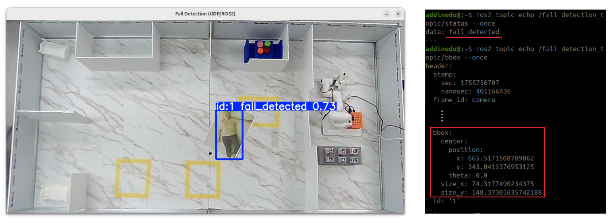

 

### ArUco Marker Detection
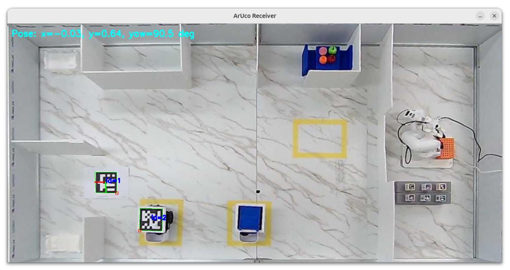
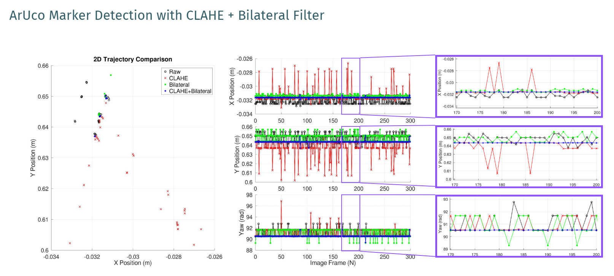
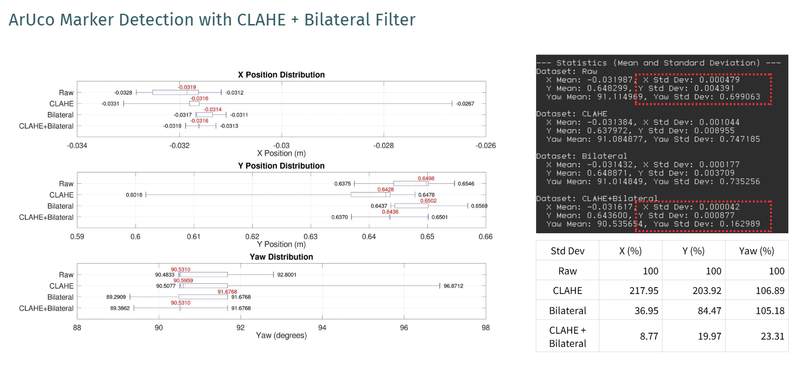
 

## Mobile Robots
### Autonomous Driving Architecture
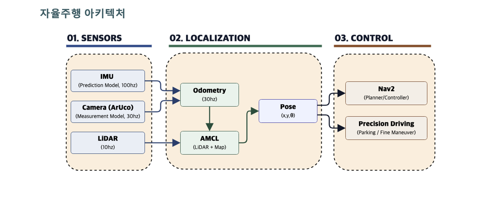 
### Aruco Marker Odometry with Sensor Fusion
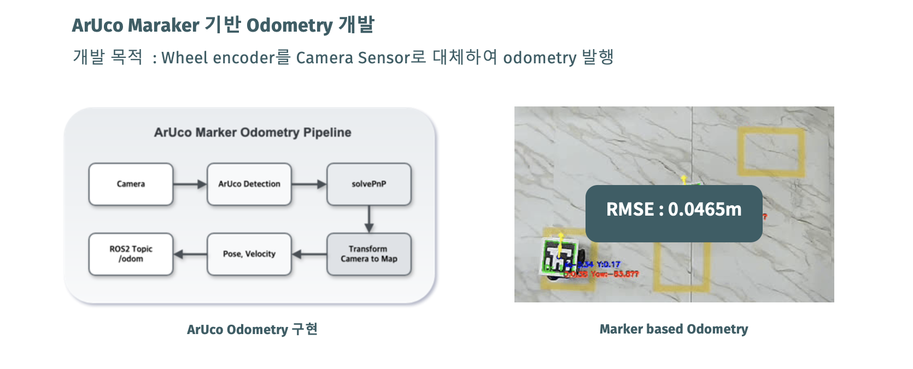
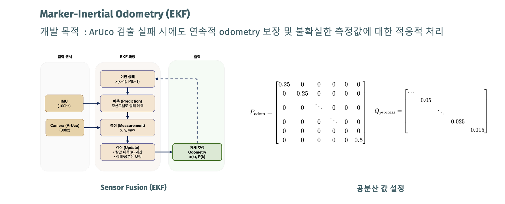
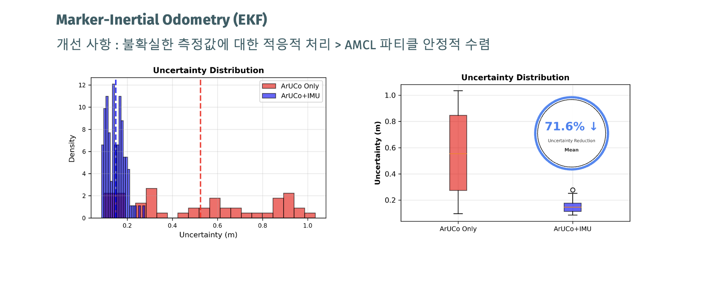

### Mobile Robot Control
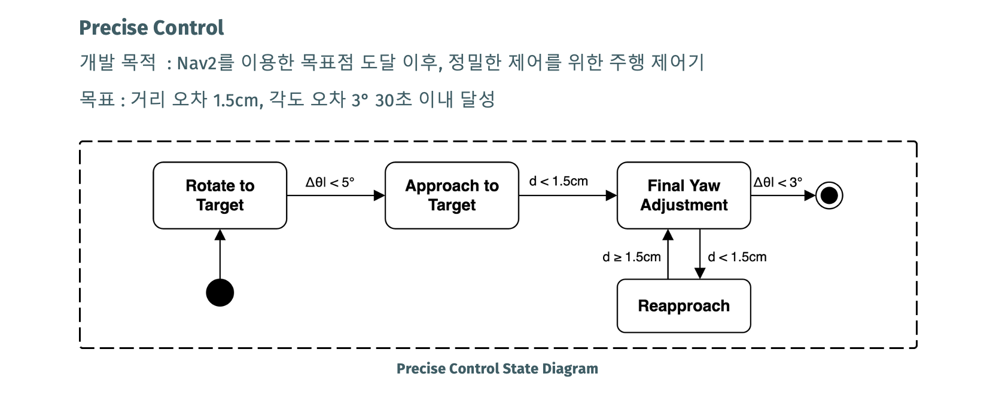
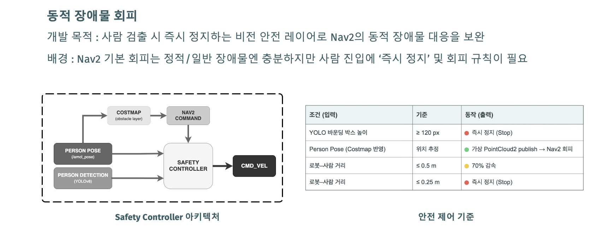

 

## Multi-Robot Control System
### ???

 

## Manipulator
### TCP vs. UDP <a href="https://youtube.com/shorts/jgOKWCgC6g4?si=p_9TIRYr5YMuHrkH">Video Demo</a>

### 물품 탐색 및 분류 후 Pick & Place <a href="https://youtube.com/shorts/nGim0zZXDp8?si=m3Fh_BKGykL91u_g">Video Demo</a>

 

## GUI
### Client GUI

 

### Admin GUI
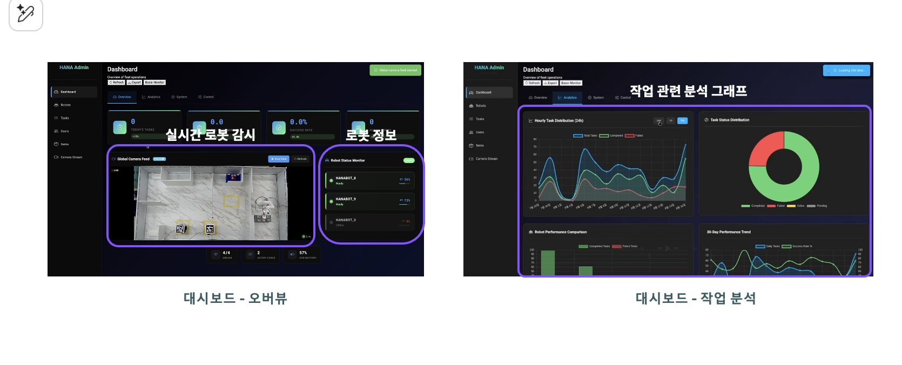
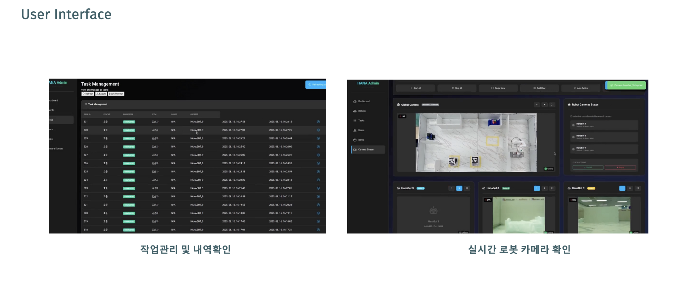
 

## AI 기반 요양 케어 자동화 시스템 <a href="https://youtu.be/ZZ3zroNBlqo?si=c7IFToJwzir5f4Py">Video Demo</a>

 

## Project Schedule
Project Period: 2025.06.23~2025.08.22

 
